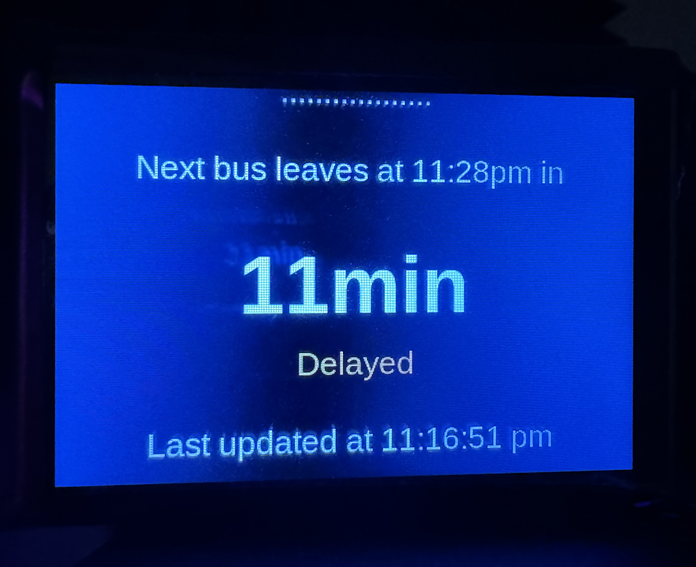

# TransitTracker

TransitTracker is a simple python application I made to easily track when my next local bus would arrive.
This application uses the [Translink API](https://www.translink.ca/about-us/doing-business-with-translink/app-developer-resources/rtti)



## Prerequisites

- \>= [Python 3.11.0](https://www.python.org/downloads/)
- Requests

```
$ python -m pip install requests
```

## Usage

1. To automate the authentication process, you can create a credentials.json file in the top level directory
   > i.e. it should look something like:

```
{"api_key": "your_api_key"}
```

2. Run the app by navigating to /src/ and execute:

```
$ python transittracker.py
```

3. If you are running this on a raspberry pi, you can enable the display option with an automatic startup script:

```
$ ./start-transittracker.sh
```

or

```
$ python transittracker.py -d
```
