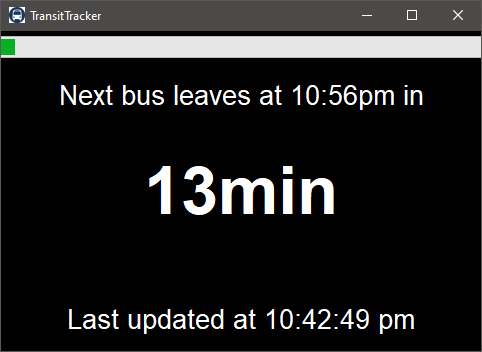

# TransitTracker

TransitTracker is a simple python application I made to easily track when my next local bus would arrive.
This application uses the [Translink API](https://www.translink.ca/about-us/doing-business-with-translink/app-developer-resources/rtti) and optionally the [Transit App API](https://transitapp.com/apis).



## Prerequisites

- \>= [Python 3.11.0](https://www.python.org/downloads/)
- Requests

```
$ python -m pip install requests
```

## Usage

1. To automate the authentication process, you can create a credentials.json file in the top level directory
   > i.e. it should look something like (translink api mandatory, transit app api optional):

```
{"translink_api_key": "your_translink_api_key",
 "transit_app_api_key": "your_transit_app_api_key"}
```

2. Run the app by executing:

```
$ python start.py
```

3. If you are running this on a raspberry pi, you can enable the display option with an automatic startup script:

```
$ ./start-transittracker.sh
```

or

```
$ python start.py -d
```

if running on a desktop, you can limit the screen size to a small window using the -w flag

```
$ python start.py -w
```

## Auto start

To enable script auto start on bootup, run

```
$ sudo nano ~/.bashrc
```

to edit your `.bashrc` file and add the following lines:

> make sure to edit the `<username>` field with your username

```
#run transittracker on startup
/home/<username>/transittracker/start-transittracker.sh
```
